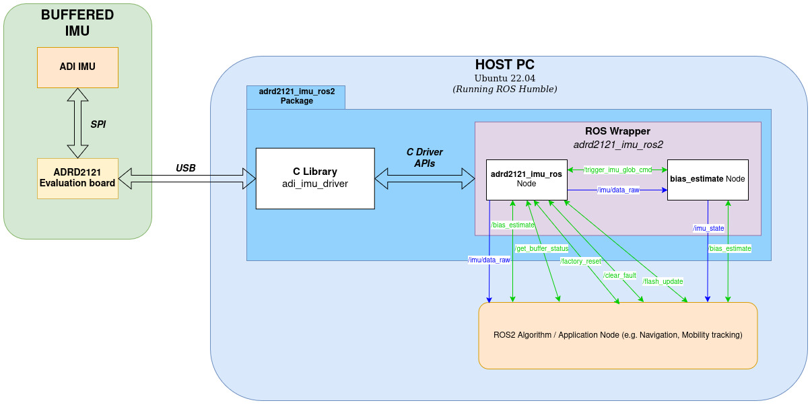

# adrd2121_imu

# Background
- This ROS2 package is an implementation of the prior ROS1 driver, now adapted for ROS2.
- The ADRD2121 is a hardware and software solution designed to buffer IMU data. (For more info, see: [EVAL-ADRD2121-EBZ Evaluation board](https://www.analog.com/en/resources/evaluation-hardware-and-software/evaluation-boards-kits/eval-adrd2121-ebz.html))
- A C-based library is used as a dependency: [adi_imu_driver Github]
- Supported IMUs are: [ADIS16470](https://www.analog.com/en/products/adis16470.html), [ADIS16500](https://www.analog.com/en/products/adis16500.html)
- Enable user to recover board either automatically or manually through functions and services. 
- Supported communication interface for **Host <-> ADRD2121** are: USB.
- Supported platform/s are: x86
- Supported ROS2 Distro: Humble

## Software Architecture


# Software Setup

## Clone this repository

Clone this package and its submodules into your workspace:
```bash
cd ~/ros2_ws/src
git clone <copied SSH or HTTPS link here> adrd2121_imu
```

## Install Dependencies

> List of dependencies:
>
> - [adi_imu_driver Github]

**IMPORTANT**: Dependencies will automatically be cloned and installed during _build_. **Proceed to [Build](#build)**.

## Build
If not familiar with building a ROS2 package, you may visit [here.](https://docs.ros.org/en/humble/Tutorials/Beginner-Client-Libraries/Creating-Your-First-ROS2-Package.html#build-a-package)

Here is how to activate TIMING_DEBUG when building the package:

_Build at ~/ros2_ws_
```bash
####### [TERMINAL 1] #######
# Make sure that ROS2 environment variables are properly sourced
## $ source/opt/ros/<ROS2 version>/setup.bash
$ source /opt/ros/humble/setup.bash

# Resolve any dependencies
$cd ~/ros2_ws
$ rosdep install -i --from-path src --rosdistro humble -y

# Build 
$ colcon build

## To clean first before building, you may run the following instead:
## $ colcon build --cmake-clean-first

## To enable the Timing Debug mode, you may run this:
## $ colcon build --cmake-args -DADRD2121_IMU_TIMING_DEBUG=ON
```
> _**Note**_: Building will automatically add a _dependencies_ subdirectory and should be ignored by git.

> **_Note_**: Sourcing should also be done in another terminal as launching should not be done in the same terminal where the package has been built, as discussed here in [ROS2 Source the overlay](https://docs.ros.org/en/humble/Tutorials/Beginner-Client-Libraries/Creating-A-Workspace/Creating-A-Workspace.html#source-the-overlay).

> **IMPORTANT**
> + When changing workspaces (commit_ws <-> test_ws), also make sure that a new terminal is used, as there will be times that the package from one workspace will be the one to be built even after changing workspaces. 

# Hardware Setup

## Access to device
- When the device is connected to the Host PC, it will be listed like `/dev/ttyACM0` where number can change depending on how many ACM devices are connected.
- To access the device, listed below are two ways to so.
**IMPORTANT**: This is required before [Launch](#launch), else launch will fail.

### Temporary Access
This method would be required every time the device was connected to the Host PC.

Step 1. Before connecting run the following command in the terminal `dmesg -w`

  Sample Result:
  ```sh
  [ 1343.478484] usb 1-5: new full-speed USB device number 9 using xhci_hcd
  [ 1343.628368] usb 1-5: New USB device found, idVendor=0483, idProduct=5740, bcdDevice= 2.00
  [ 1343.628372] usb 1-5: New USB device strings: Mfr=1, Product=2, SerialNumber=3
  [ 1343.628374] usb 1-5: Product: STM32 Virtual ComPort
  [ 1343.628376] usb 1-5: Manufacturer: STMicroelectronics
  [ 1343.628377] usb 1-5: SerialNumber: 3984356B3037
  [ 1343.650144] cdc_acm 1-5:1.0: ttyACM0: USB ACM device
  [ 1343.655026] usbcore: registered new interface driver cdc_acm
  [ 1343.655028] cdc_acm: USB Abstract Control Model driver for USB modems and ISDN adapters
  ```
  In this result, the device was listed as `/dev/ttyACM0`.

Step 2. Change the permission of the device such that the owner, group, and others have rw access to it.

  ``` sh
  $ sudo chmod 666 /dev/ttyACM0
  ```

Step 3. Check if successful:
  ```sh
  $ ls -l /dev/ttyACM0
  crw-rw-rw- 1 root dialout 166, 0 Feb 28 11:37 /dev/ttyACM0
  ```

### Permanent Access (via custom udev rules)
This method would only be required on initial setup, but may vary on each device (e.g. if you have more than 1 ADRD2121 + IMU device, you need to create a udev rule for each one).

Step 1. Before connecting run the following command in the terminal `dmesg -w`

  Sample Result:
  ```sh
  [ 1343.478484] usb 1-5: new full-speed USB device number 9 using xhci_hcd
  [ 1343.628368] usb 1-5: New USB device found, idVendor=0483, idProduct=5740, bcdDevice= 2.00
  [ 1343.628372] usb 1-5: New USB device strings: Mfr=1, Product=2, SerialNumber=3
  [ 1343.628374] usb 1-5: Product: STM32 Virtual ComPort
  [ 1343.628376] usb 1-5: Manufacturer: STMicroelectronics
  [ 1343.628377] usb 1-5: SerialNumber: 3984356B3037
  [ 1343.650144] cdc_acm 1-5:1.0: ttyACM0: USB ACM device
  [ 1343.655026] usbcore: registered new interface driver cdc_acm
  [ 1343.655028] cdc_acm: USB Abstract Control Model driver for USB modems and ISDN adapters
  ```
  In this result, the device `subsystem=tty, idProduct=5740, idVendor=0483, and SerialNumber: 3984356B3037`.

  **Note**: The idProduct and idVendor of the device will be the same and only the SerialNumber will change.

  In case, the SerialNumber did not appear in Step 1, try the following command:
  ```sh
  # $ sudo lsusb -d <idVendor:idProduct> -v | grep iSerial
  $ sudo lsusb -d 0483:5740 -v | grep iSerial
    iSerial                 3 3984356B3037
  ```

Step 2. Install the following packages.
  ```sh
  $ sudo apt-get install usbutils
  $ sudo apt-get install udev
  ```

Step 3. Create the udev rule file:

File Name: `99-adrd2121.rules`
+ _99_ is the order of the rule, the lower number will be read first.
+ _adrd2121_ can be changed depending on your preference.

`99-adrd2121.rules` file content:

  ```sh
  SUBSYSTEM=="tty", ATTRS{idVendor}=="0483", ATTRS{idProduct}=="5740", ATTRS{serial}=="3984356B3037", SYMLINK+="adrd2121", MODE="0666"
  ```

>  **IMPORTANT**
>
>  + The `SYMLINK+="adrd2121"` will create a symbolink link `/dev/adrd2121` for the specific device that matches the SUBSYSTEM, idVendor, idProduct, and serial number.
>
> + This would mean that you can also access the device via the device name `/dev/ttyACM0` (depending on the logs in Step 1) or `/dev/adrd2121`.
>
> + Adding the `SYMLINK+="adrd2121"` resolves any problem to changing devices names.

Step 4. Copy `99-adrd2121.rules` to /etc/udev/rules.d
  ```sh
  $ sudo cp 99-adrd2121.rules /etc/udev/rules.d
  ```

Step 5. Restart USB device Manager
  ```sh
  $ sudo udevadm control --reload-rules && sudo udevadm trigger
  # Wait at least 5 seconds for restart to finish
  ```

Step 6. Check if successful:
  ```sh
  $ ls -l /dev/ttyACM0
  crw-rw-rw- 1 root root 166, 0 Feb 28 11:39 /dev/ttyACM0
  $ ls -l /dev/adrd2121
  lrwxrwxrwx 1 root root 7 Feb 28 11:38 /dev/adrd2121 -> ttyACM0
  ```

# Launch

This section will discuss how to use the launch files, and Launch files will run _adrd2121_imu_node_ and (optionally) _bias_estimate_node_ros2_ in sequence depending on the ```TimerAction``` delay.

The included launch files will run the following nodes:
+ For **ADIS16470**
  - [adrd2121_imu_node](#adrd2121_imu_node)
  - [bias_estimate_node](#bias_estimate_node_ros2)
+ For **ADIS16500**
  - [adrd2121_imu_node](#adrd2121_imu_node)

### Default launch

```sh
###### [TERMINAL 2] ######
#Properly sourcing the overlay
$ cd ~/ros2_ws
$ source install/setup.bash

# Launch 
## $ ros2 launch adrd2121_imu <imu_product>.launch.py
## Example for launching ADIS16470
$ ros2 launch adrd2121_imu adis16470.launch.py
```
> **IMPORTANT**
> 
> + Make sure that a separate terminal is used other than the terminal used to build the package, as mentioned [here](https://docs.ros.org/en/foxy/Tutorials/Beginner-Client-Libraries/Creating-A-Workspace/Creating-A-Workspace.html#source-the-overlay).
### Change log level for nodes
```sh
## If the user wants to enable debug logs, launch the package with the following command:
$ ros2 launch adrd2121_imu adis16470.launch.py log_level:=DEBUG

## Other available log levels are as follows: INFO (default), WARN, ERROR
```


### Delayed execution of bias_estimate_node
+ Another thing to take note is the delayed launching of the **bias_estimate** node, shown below:

**_[adis16470.launch.py](launch/adis16470.launch.py)_**

```sh 
...
OnProcessStart(
                target_action=main_node_run,
                on_start=[
                    TimerAction(
                        period=5.0,
                        actions=[bias_node_run]
                    )
                ]
            )
...
```
+ This implementation launches the main node _(adrd2121_imu_node)_ first, then in the background starts a timer _(period)_, running in _**seconds**_. **Once the timer finishes, only then the action _(bias_node_run)_ will be executed.**
+ The user is freely to change the period value if so desired. This clause was added in order to avoid sync issues with bias_estimate node going to timeout after not detecting the /imu/data_raw topic. 

# Nodes

## adrd2121_imu_node

### Operation modes
+ The user will be able to configure what mode to run through the _**mode_of_operation**_ parameter.

### Board recovery
  + To set the board recovery during initialization, set the parameter **enable_init_recover** to true.
  + If enabled, the node will automatically check the status of the board and recover to working state if applicable. 

### Published topics
+ **/imu/data_raw** (default:`sensor_msgs/Imu` **or** custom msg:`adrd2121_imu/AdiImu`)
  - Raw IMU data containing angular velocity (x,y,z) and linear_acceleration (x,y,z)
  - See [AdiImu.msg](msg/AdiImu.msg) for more info on custom message.
  - Msg type is set in adi_imu_driver_node Parameters.

### Advertised services
+ **/trigger_imu_glob_cmd** (adrd2121_imu/ImuGlobCmd)
  - Write 1 to specified BIT in GLOB_CMD IMU Register;
  - See custom service message: [srv/ImuGlobCmd.srv](srv/ImuGlobCmd.srv)
  - **NOT SUPPORTED** in **ADIS16500**
> NOTE:
> 1. Only the Bias Correction Update (Bit 0) is supported for now;
> 2. DO NOT directly call this service as it will affect the IMU's performance;
>    - For Bias Correction Update, IMU needs to be standstill for at least 40s or else,
>       the IMU data would gain offset. See /bias_estimate service instead.
+ **/factory_reset** (std_srvs/Trigger)
  - This will revert the ADRD2121 back to its factory configuration
+ **/clear_fault** (std_srvs/Trigger)
  - This should remove all the FAULT status in the ADRD2121
+ **/flash_update** (std_srvs/Trigger)
  - This will save the current configuration of the Buffer Board to the flash memory, which will be loaded in the next boot-up. 
+ **/get_buffer_status** (adrd2121_imu/BufStatus)
  - This is meant for acquiring the current status of the Buffer Board. 
  - Status codes and their implications can be found in the ADRD2121 Github's register definitions (see STATUS).

### Parameters

>**IMPORTANT**: 
> + If any of these parameters are not set, the default values will be used. See [config/[IMU_name].yaml](/config) on how these parameters are set.
> +  There will be times that some parameters will not be declared if it will not be used in the whole runtime i.e. _if update_imu_accl_bias is false, imu_accl_bias will not be declared_. 
> + Changing the value of a parameter during runtime (via `ros2 param set`) is not possible as parameters are set to _**read-only**_. 

#### ROS Specific Parameters
+ **topic_name** (string, default: imu/data_raw)
  - IMU topic name
+ **frame_name** (string, default: imu)
  - IMU frame name
+ **msg_type** (int, default: 1)
  - Message type of topic
    + "1" : sensor_msgs/Imu
    + "2" : adrd2121_imu/AdiImu
+ **mode_of_operation** (int, default: 0)
  - This is used to check what operation mode the node will run in.
    + "1" : _**STREAM**_ - this will enable all functions related to data streaming.
      + Services available: **trigger_imu_glob_cmd** and **get_buffer_status** 
    + "2" : _**RECOVERY**_ - data streaming is disabled here. This is meant for clearing error codes. 
      + Services available: **factory_reset**, **clear_fault**, **flash_update**, and **get_buffer_status** 
      + This will skip any initializations for both IMU and the Buffer Board, but UART communication must be established. 

#### Communication Interface Parameters
+ **usb_dev** (string, default: /dev/ttyACM0)
  - Device name
+ **usb_baud** (int, default: 921600)
  - USB Baud Rate

#### ADRD2121 Parameters
+ **buf_burst_count** (int, default: 1)
  - Burst Count is a parameter that allows multiple transactions in a single syscall
+ **enable_imu_burst** (bool, default: true)
  - Enables IMU burst data capture for buffer entries (IMU <-> ADRD2121)
  - See BUF_CONFIG Register
+ **buf_overflow** (int, default: 0)
  - Buffer overflow behavior;
    + "0" : Stop Sampling
    + "1" : Replace Oldest Data
  - See BUF_CONFIG Register
+ **enable_buf_pps** (bool, default: false)
  - Trigger PPS_ENABLE
  - See USER_CMD Register
+ **buf_data_rdy_sel** (int, default: 1)
  - Select which IMU DIO output pin is treated as data ready
    + "1" : BUF_DIO1
    + "2" : BUF_DIO2
    + "4" : BUF_DIO3
    + "8" : BUF_DIO4
  - See DIO_INPUT_CONFIG Register
  - For **ADIS16470** and **ADIS16500**, only BUF_DIO1 is possible.
+ **buf_data_rdy_pol** (int, default: 1)
  - Data ready trigger polarity
    + "0" : triggers on falling edge
    + "1" : triggers on rising edge
+ **buf_pps_sel** (int, default: 0)
  - Select which host processor DIO output pin acts as a Pulse Per Second (PPS) input
    + "0" : Disabled
    + "1" : BUF_DIO1
    + "2" : BUF_DIO2
    + "4" : BUF_DIO3
    + "8" : BUF_DIO4
  - See DIO_INPUT_CONFIG Register
+ **buf_pps_pol** (int, default: 1)
  - PPS trigger polarity
    + "0" : triggers on falling edge
    + "1" : triggers on rising edge
  - See DIO_INPUT_CONFIG Register
+ **buf_pps_freq**(int, default: 0)
  - Possible values: [0-3], where PPS Input Frequency is (10 ^ (buf_pps_freq) Hz).
  - See DIO_INPUT_CONFIG Register
+ **buf_pin_pass** (int, default: 0)
  - Select which pins are directly connected from the host processor to the IMU using an ADG1611 analog switch
    + "0" : Disabled
    + "1" : BUF_DIO1
    + "2" : BUF_DIO2
    + "4" : BUF_DIO3
    + "8" : BUF_DIO4
  - See DIO_OUTPUT_CONFIG Register
+ **buf_watermark_int** (int, default: 0)
  - Select which pins are driven with the buffer watermark interrupt signal from the ADRD2121 firmware
    + "0" : Disabled
    + "1" : BUF_DIO1
    + "2" : BUF_DIO2
    + "4" : BUF_DIO3
    + "8" : BUF_DIO4
  - See DIO_OUTPUT_CONFIG Register
+ **buf_overflow_int** (int, default: 0)
  - Select which pins are driven with the buffer overflow interrupt signal from the ADRD2121 firmware
    + "0" : Disabled
    + "1" : BUF_DIO1
    + "2" : BUF_DIO2
    + "4" : BUF_DIO3
    + "8" : BUF_DIO4
  - See DIO_OUTPUT_CONFIG Register
+ **buf_error_int** (int, default: 0)
  - Select which pins are driven with the error interrupt signal from the ADRD2121 firmware
    + "0" : Disabled
    + "1" : BUF_DIO1
    + "2" : BUF_DIO2
    + "4" : BUF_DIO3
    + "8" : BUF_DIO4imu_accl_bias
  - See DIO_OUTPUT_CONFIG Register
+ **enable_init_recovery** (bool, default: false)
  - This is a boolean that is checked whether to call the recovery process automatically or not.
  - If enabled, it will start the recovery process. If recovery is unsuccessful, it will proceed to **CONFIG** mode
+ **clear_buffer_timeout** (int, default: 500)
  - Clearing/Flushing Serial Port timeout in milliseconds.
  - This timeout is used when flushing serial port's input after stopping the capture of data
  - Range: 500-3000 ms   


#### IMU Parameters
+ **imu_prod_id** (int, default: 16470)
  - IMU Product ID (16470, 16500)
+ **gravity** (double, default: 1.0)
  - Gravity constant; if 1.0 accelerometer output is normalized to g
+ **imu_data_format** (int, default: 1)
  - IMU Data Format (for Burst Read or non-Burst Read)
    + "0" : 16-bit
    + "1" : 32-bit
  - For **ADIS16470**: for Burst Read, data format is fixed to 16-bit;
  - For **ADIS16500**: either Burst Read or non-Burst Read, data format can be 16- or 32-bit
+ **gravity** (double, default: 1.0)
  - Gravity constant; if 1.0 accelerometer output is normalized to g
+ **imu_data_rate** (int, default: 100)
  - IMU Data Rate in Hz
+ **imu_data_rdy_line** (int, default: 0)
  - IMU Data ready line selection
    + "0" : IMU_DIO1
    + "1" : IMU_DIO2
    + "2" : IMU_DIO3
    + "3" : IMU_DIO4
  - **UNUSED** in: **ADIS16470** and **ADIS16500** (Data ready line is fixed)
+ **imu_data_rdy_pol** (int, default: 1)
  - IMU Data ready polarity
    + "0" : IMU_NEG_POLARITY
    + "1" : IMU_POS_POLARITY
+ **enable_imu_sync_clk** (bool, default: false)
  - IMU Sync clock input enable
+ **imu_sync_clk_mode** (int, default: 0)
  - IMU Sync clock mode
  - For **ADIS16470** or **ADIS16500**
    + "0" : IMU_INTERNAL_CLOCK
    + "1" : IMU_DIRECT_SYNC
    + "2" : IMU_SCALED_SYNC
    + "3" : IMU_OUTPUT_SYNC
  - Used only if *imu_sync_clk_mode* is true
+ **imu_sync_clk_line** (int, default: 0)
  - IMU Sync clock input line selection
    + "0" : IMU_DIO1
    + "1" : IMU_DIO2
    + "2" : IMU_DIO3
    + "3" : IMU_DIO4
  - Used only if *imu_sync_clk_mode* is true
  - **UNUSED** in: **ADIS16470** and **ADIS16500** (SYNC line is fixed)
+ **imu_sync_clk_pol** (int, default: 1)
  - IMU Sync clock input polarity
    + "0" : IMU_NEG_POLARITY
    + "1" : IMU_POS_POLARITY
  - Used only if *imu_sync_clk_mode* is true
+ **enable_imu_lin_g_comp** (bool, default: true)
  - Linear g compensation for gyroscopes
+ **enable_imu_pp_align** (bool, default: true)
  - Point of percussion alignment
+ **update_imu_bias_corr** (bool, default: false)
  - Trigger Bias Correction Update in IMU GLOB_CMD register
  - **UNUSED** in: **ADIS16500** (Not supported by IMU)
+ **imu_time_base_control** (int, default: 10)
  - Time Base Control (TBC)
    + For **ADIS16470**, range: 0 to 12
  - Used only if *update_imu_bias_corr* is true
  - **UNUSED** in: **ADIS16500** (Not supported by IMU)
+ **enable_imu_accl_z_bias_null** (int, default: 0)
  - Z-axis acceleration bias correction enable ("0" : disable, "1" : enable)
  - Used only if *update_imu_bias_corr* is true
  - **UNUSED** in: **ADIS16500** (Not supported by IMU)
+ **enable_imu_accl_y_bias_null** (int, default: 0)
  - Y-axis acceleration bias correction enable ("0" : disable, "1" : enable)
  - Used only if *update_imu_bias_corr* is true
  - **UNUSED** in: **ADIS16500** (Not supported by IMU)
+ **enable_imu_accl_x_bias_null** (int, default: 0)
  - X-axis acceleration bias correction enable ("0" : disable, "1" : enable)
  - Used only if *update_imu_bias_corr* is true
  - **UNUSED** in: **ADIS16500** (Not supported by IMU)
+ **enable_imu_gyro_z_bias_null** (int, default: 1)
  - Z-axis gyroscope bias correction enable ("0" : disable, "1" : enable)
  - Used only if *update_imu_bias_corr* is true
  - **UNUSED** in: **ADIS16500** (Not supported by IMU)
+ **enable_imu_gyro_y_bias_null** (int, default: 1)
  - Y-axis gyroscope bias correction enable ("0" : disable, "1" : enable)
  - Used only if *update_imu_bias_corr* is true
  - **UNUSED** in: **ADIS16500** (Not supported by IMU)
+ **enable_imu_gyro_x_bias_null** (int, default: 1)
  - X-axis gyroscope bias correction enable ("0" : disable, "1" : enable)
  - Used only if *update_imu_bias_corr* is true
  - **UNUSED** in: **ADIS16500** (Not supported by IMU)
+ **update_imu_accl_bias** (bool, default: false)
  - Set Accelerometer bias
  - Values based on *imu_accl_bias*
+ **imu_accl_bias[3]** (int, default: [0,0,0])
  - Accelerometer bias values
    + [Accl Bias X, Accl Bias Y, Accl Bias Z] where each input is 32-bit
  - Used only if *update_imu_accl_bias* is true
+ **update_imu_gyro_bias** (bool, default: false)
  - Set Gyroscope bias
  - Values based on *imu_gyro_bias*
+ **imu_gyro_bias[3]** (int, default: [0,0,0])
  - Gyroscope bias values
    + [Gyro Bias X, Gyro Bias Y, Gyro Bias Z] where each input is 32-bit
  - Used only if *update_imu_gyro_bias* is true
+ **update_imu_accl_scale** (bool, default: false)
  - Set Accelerometer scale
  - Values based on *imu_accl_scale*
  - **UNUSED** in: **ADIS16470** and **ADIS16500** (Not supported by IMU)
+ **imu_accl_scale[3]** (int, default: [0,0,0])
  - Accelerometer scale values
    + [Accl Scale X, Accl Scale Y, Accl Scale Z] where each input is 16-bit
  - Used only if *update_imu_accl_scale* is true
  - **UNUSED** in: **ADIS16470** and **ADIS16500** (Not supported by IMU)
+ **update_imu_gyro_scale** (bool, default: false)
  - Set Gyroscope scale
  - Values based on *imu_gyro_scale*
  - **UNUSED** in: **ADIS16470** and **ADIS16500** (Not supported by IMU)
+ **imu_gyro_scale[3]** (int, default: [0,0,0])
  - Gyroscope scale values
    + [Gyro Scale X, Gyro Scale Y, Gyro Scale Z] where each input is 16-bit
  - Used only if *update_imu_gyro_scale* is true
  - **UNUSED** in: **ADIS16470** and **ADIS16500** (Not supported by IMU)
## bias_estimate_node_ros2
- This Node has implements a standstill checker and makes sure that the IMU is standstill for at least 40s before triggering the Bias Correction Update (bit 0 of GLOB_CMD) via the /trigger_imu_glob_cmd.
- **NOTE**: For multiple instances of IMU, this should be under the same <_group_> of the adrd2121_imu_node. 
- **NOT SUPPORTED** in **ADIS16500** because **/trigger_imu_glob_cmd** will not be advertised.

### Published topics
+ **/imu_state** (`adrd2121_imu/ImuState`)
  - Contains the state of the IMU (*MOVING* or *STANDSTILL*) based on the standstill checker
  - See [msg/ImuState.msg](msg/ImuState.msg)

### Subscribed Topics
+ **/imu/data_raw** (default:`sensor_msgs/Imu` **or** custom msg:`adrd2121_imu/AdiImu`)
  - Raw IMU data containing angular velocity (x,y,z) and linear_acceleration (x,y,z)
  - **NOTE**: This topic should not be remapped (i.e. ```<remap from="/imu/data_raw" to="/adis16470/data_raw"/>```), instead, be changed in the param *imu_topic_name*.

### Advertised Services
+ **/bias_estimate** (adrd2121_imu/BiasEstimateCmd)
  - Will call the trigger_glob_cmd service and trigger the Bias Correction update
  - See custom service message: [srv/BiasEstimateCmd.srv](srv/BiasEstimateCmd.srv)

### Parameters

+ **gyro_std_thresh** (double, default: 0.02)
  - The threshold for standard deviation of gyroscope magnitude;
  - This determines whther IMU is *MOVING* or *STANDSTILL*
  - The lower the value, the more sensitive (i.e. slight IMU movement may be considered as MOVING already)
+ **accl_std_thresh** (double, default: 0.08)
  - The threshold for standard deviation of accelerometer magnitude;
  - This determines whther IMU is *MOVING* or *STANDSTILL*
  - The lower the value, the more sensitive (i.e. slight IMU movement may be considered as MOVING already)
+ **imu_topic_name** (string, default: /imu/data_raw)
  - In case the subscribed topic has a different name, this parameter must be updated;
  - The Node checks the message type of the specified topic (`sensor_msgs/Imu` **or** `adrd2121_imu/AdiImu`).

  [adi_imu_driver Github]: <https://github.com/analogdevicesinc/adi-imu-driver/tree/compact_imu>
